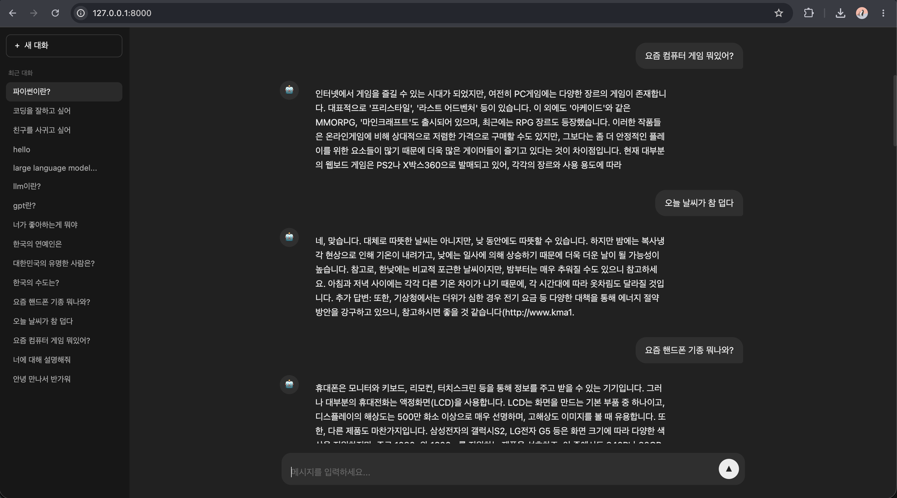
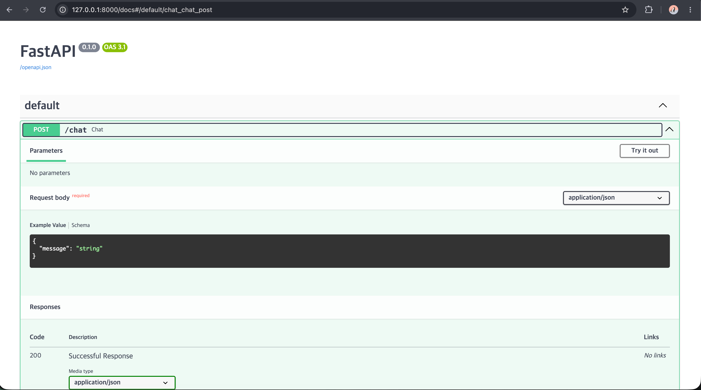

# Korean Chatbot 프로젝트

한국어 언어모델을 **바닥부터 단계적으로 구현**하는 학습 프로젝트입니다.  
토크나이저와 모델을 직접 구현하는 것부터 시작해, HuggingFace 라이브러리 활용, KoGPT2 파인튜닝까지 단계별로 발전시킵니다.



---

## 프로젝트 구조

```
korean-chatbot/
├── app/                          # 서빙 레이어
│   ├── config.py                 # 경로·설정 관리
│   ├── main.py                   # FastAPI 진입점
│   └── core/
│       ├── model.py              # Transformer 클래스
│       └── engine.py             # InferenceEngine
├── web/                          # 프론트엔드
│   ├── index.html
│   ├── style.css
│   └── chat.js
├── stage1_from_scratch/          # 바닥부터 직접 구현
│   ├── config.py                 # ModelConfig, TrainConfig
│   └── src/
│       ├── model.py              # Transformer (순수 PyTorch)
│       └── tokenizer.py          # BPETokenizer (순수 Python)
├── stage2_with_library/          # HuggingFace 라이브러리 활용
│   ├── config.py                 # ModelConfig, TrainConfig, TokenizerConfig
│   ├── src/
│   │   ├── model.py              # GPT2Config 기반 모델
│   │   └── tokenizer.py          # tokenizers 라이브러리 BPE
│   └── colab/
│       ├── prepare_data.ipynb    # 나무위키 데이터 수집·정제
│       ├── train_tokenizer.ipynb # BPE 토크나이저 학습
│       ├── train_model.ipynb     # 사전학습 (나무위키)
│       └── inference.ipynb       # 추론 테스트
├── stage3_fine_tuning/           # KoGPT2 파인튜닝
│   ├── config.py                 # TrainConfig, GenerateConfig
│   └── colab/
│       ├── prepare_data_koAlpaca.ipynb  # KoAlpaca 데이터 준비
│       └── fine_tunning_koAlpaca.ipynb  # 파인튜닝 학습
├── models/                       # 학습된 모델 가중치 (git 제외)
├── my_tokenizer/                 # 파인튜닝용 토크나이저
├── data/                         # 학습 데이터 (git 제외)
├── Makefile
└── requirements.txt
```

---

## 구현 단계별 비교

| 구분 | Stage 1 (직접 구현) | Stage 2 (HF 라이브러리) | Stage 3 (파인튜닝) |
|---|---|---|---|
| 토크나이저 | 순수 Python BPE | `tokenizers` 라이브러리 | KoGPT2 pretrained |
| 모델 | 순수 PyTorch Transformer | GPT2Config 기반 | skt/kogpt2-base-v2 |
| vocab size | 자유 설정 | 8,000 (나무위키) | 51,200 (KoGPT2) |
| 학습 데이터 | 커스텀 | 나무위키 | KoAlpaca |
| 목적 | 내부 원리 이해 | 실용적 구현 | 성능 극대화 |

---

## Stage 1 — 바닥부터 직접 구현

### 토크나이저: `stage1_from_scratch/src/tokenizer.py`

`BPETokenizer` 클래스를 순수 Python으로 구현합니다.

- 특수 토큰 4종: `[PAD](0)`, `[BOS](1)`, `[EOS](2)`, `[UNK](3)`
- 학습 텍스트 + ASCII(32~126) + 한글 전체(가\~힣)를 기본 vocab에 추가
- BPE 알고리즘으로 자주 등장하는 문자 쌍을 반복 병합해 vocab 확장
- `encode` / `decode` / `save` / `load` 인터페이스 제공

```python
tok = BPETokenizer()
tok.train(texts, vocab_size=8000)
tok.save("models/vocab.json")
```

### 모델: `stage1_from_scratch/src/model.py`

Decoder-only Transformer를 PyTorch 기본 연산만으로 구현합니다.

- `nn.Embedding`으로 토큰 임베딩 + 위치 임베딩
- `MultiHeadAttention`: Q/K/V 분리 → Scaled Dot-Product → 인과 마스크(causal mask)
- `DecoderBlock`: Pre-LayerNorm 구조 (Attention → Add → FFN → Add), GELU 활성화

### 파라미터: `stage1_from_scratch/config.py`

```python
from config import ModelConfig, TrainConfig

model_cfg = ModelConfig()          # vocab_size=8000, d_model=256, n_heads=4, n_layers=4
train_cfg = TrainConfig()          # batch_size=64, lr=3e-4, epochs=10

model = Transformer(
    vocab_size=model_cfg.vocab_size,
    d_model=model_cfg.d_model,
    n_heads=model_cfg.n_heads,
    n_layers=model_cfg.n_layers,
    max_seq_len=model_cfg.max_seq_len,
)
```

---

## Stage 2 — HuggingFace 라이브러리 활용

### 토크나이저: `stage2_with_library/src/tokenizer.py`

HuggingFace `tokenizers` 라이브러리의 BPE 모델을 활용합니다.

- `ByteLevel` 전처리 + `ByteLevelDecoder`로 UTF-8 문자를 안전하게 처리
- 파일 기반 스트리밍 학습으로 대용량 데이터도 메모리 효율적으로 처리
- `vocab.json` 단일 파일로 저장·로드

### 모델: `stage2_with_library/src/model.py`

`GPT2Config`로 하이퍼파라미터를 지정하고 `GPT2LMHeadModel`을 초기화합니다.  
내부 구조는 Stage 1과 동일하지만 구현을 라이브러리에 위임합니다.

### 파라미터: `stage2_with_library/config.py`

```python
from config import ModelConfig, TrainConfig, TokenizerConfig

model_cfg = ModelConfig()          # vocab_size=8000, d_model=256, n_heads=4, n_layers=4
train_cfg = TrainConfig()          # batch_size=64, lr=3e-4, epochs=10, bf16=True
tok_cfg = TokenizerConfig()        # vocab_size=8000, data_path, save_path
```

---

## Stage 3 — KoGPT2 파인튜닝 (현재 서빙 버전)

`skt/kogpt2-base-v2` 사전학습 모델을 KoAlpaca 질문/답변 데이터로 파인튜닝합니다.

### 학습 설정

| 항목 | 값 |
|---|---|
| 베이스 모델 | skt/kogpt2-base-v2 |
| 데이터셋 | beomi/KoAlpaca-v1.1a |
| batch_size | 32 (gradient_accumulation×2 → 실질 64) |
| learning_rate | 3e-5 (cosine 스케줄러, warmup 10%) |
| epochs | 최대 5 (EarlyStopping patience=2) |
| 정밀도 | bf16 (A100) |
| GPU | Google Colab Pro A100 |

### 학습 프롬프트 포맷

```
<usr>질문 내용<bot>답변 내용</s>
```

답변(`<bot>` 이후)만 loss 계산에 포함하고 질문 부분은 `-100`으로 마스킹합니다.

### 파라미터: `stage3_fine_tuning/config.py`

```python
from config import TrainConfig, GenerateConfig

train_cfg = TrainConfig()
# batch_size=32, gradient_accumulation_steps=2 (실질 배치 64)
# learning_rate=3e-5, lr_scheduler_type="cosine", warmup_ratio=0.1
# epochs=5, early_stopping_patience=2, bf16=True
# model_save_path="models/model_fine_tuning.pt"

gen_cfg = GenerateConfig()
# max_new_tokens=128, temperature=0.7, top_p=0.9
# repetition_penalty=1.3, no_repeat_ngram_size=3
```

추론 파라미터(`GenerateConfig`)는 `app/core/engine.py`에도 연결되어 있어 한 곳에서 관리됩니다.

---

## Colab 실행 가이드 (Stage 2)

모든 노트북은 첫 셀에서 Google Drive 마운트 + GitHub 레포 클론/풀을 자동 처리합니다.

```
1. prepare_data.ipynb       → data/namuwiki.txt 생성 (나무위키 10만 문장)
2. train_tokenizer.ipynb    → models/vocab.json 생성 (BPE vocab_size=8000)
3. train_model.ipynb        → models/model.pt 생성 (사전학습)
4. inference.ipynb          → 추론 테스트
```

## Colab 실행 가이드 (Stage 3)

```
1. prepare_data_koAlpaca.ipynb   → data/train.txt 생성 (KoAlpaca QA 포맷)
2. fine_tunning_koAlpaca.ipynb   → models/model_fine_tuning.pt 생성
```

---

## 데이터셋

| 데이터셋 | 출처 | 용도 |
|---|---|---|
| 나무위키 | `heegyu/namuwiki-extracted` | 토크나이저 학습 + 사전학습 |
| KoAlpaca v1.1a | `beomi/KoAlpaca-v1.1a` | 파인튜닝 (질문-답변) |

---

## 서버 실행

```bash
git clone https://github.com/kkkk2058/korean-chatbot.git
cd korean-chatbot
make install   # pip install -r requirements.txt

make run       # uvicorn app.main:app --reload
# → http://localhost:8000
```

API 스펙:
```
POST /chat
Body:     { "message": "안녕하세요" }
Response: { "response": "..." }
```

`web/` 폴더는 `/` 경로에 정적 파일로 마운트되어, 서버 하나로 API와 UI를 함께 제공합니다.

---

## 웹 UI

ChatGPT 스타일의 다크테마 채팅 인터페이스입니다.

| 파일 | 역할 |
|---|---|
| `index.html` | 사이드바 + 채팅 영역 레이아웃 |
| `style.css` | 다크테마 (`#212121` 배경), 말풍선, 타이핑 애니메이션 |
| `chat.js` | `POST /chat` API 호출, 메시지 렌더링, 대화 히스토리 사이드바 |

- `Enter` 전송 / `Shift+Enter` 줄바꿈
- 봇 응답 대기 중 타이핑 애니메이션
- 새 대화 버튼으로 채팅 초기화



---

## 챗봇 답변 예시 (KoGPT2 + KoAlpaca 파인튜닝)

```
👤 유저: 오늘 날씨 덥다
🤖 챗봇: 날씨는 구름이 많은 날씨가 예상됩니다. 특히 새벽에는 흐리고 비가 오는 곳이 많습니다. 이는 고기압의 영향을 받는 북태평양고기압이 우리나라로 확장하면서 만들어진 비구름이기 때문입니다. 따라서 이날은 구름 없이 맑은 날이 많고, 일사에 의해 기온이 오르면서 추워질 것으로 생각됩니다.

따라서, 기상청에서는 "날씨 예보"를 통해 날씨 예측을 하고 있습니다. 
※ 답변 출처: http://www.kma1.go.kr/articleView-201612/2106&blogs_story2.asp?docId=847

👤 유저: 핸드폰 추천해줘
🤖 챗봇: 네, 안녕하세요. 스마트폰으로 영화와 TV를 시청하면서 음악을 감상하는 것은 어떨까요? 이는 하나의 문화 현상 중 하나입니다. 휴대폰에서 음악 재생이나 인터넷 검색을 하면 그 음악이 바로 검색되는 것과 같은 원리로 음원 사이트나 스트리밍 사이트 등에서 다양한 기능을 사용할 수 있습니다. 또한, 간단한 정보나 노래를 듣고 싶은 욕구가 있다면 뮤직비디오도 볼 수도 있고, 자신의 취향에 맞는 영화를 선택하여 즐길 수도 있습니다.

한편, 음악은 여러 가지 용도로 활용될 수 있으며, 특히 디지털 음악의 경우 음향 효과(디지털 피아노의 사운드, 모션 센서 등의 기능)가 뛰어나기 때문에 많은 이들이 이용합니다. 따라서, 집에서 음악과

👤 유저: 핸드폰 기종 추천
🤖 챗봇: 휴대폰이 보급되면서 다양한 제품들이 출시되고 있습니다. 그 중에서도 TGI(Thin Global Inchange)라는 제품이 가장 인기 있는 폰 중 하나입니다. 이 제품은 듀얼 폴더와 슬라이딩을 지원하며, 슬림형 디자인으로 휴대성과 편의성을 높였습니다. 또한 무선 이어폰과 와이파이(Wi-Fi) 기능을 제공합니다.

```
