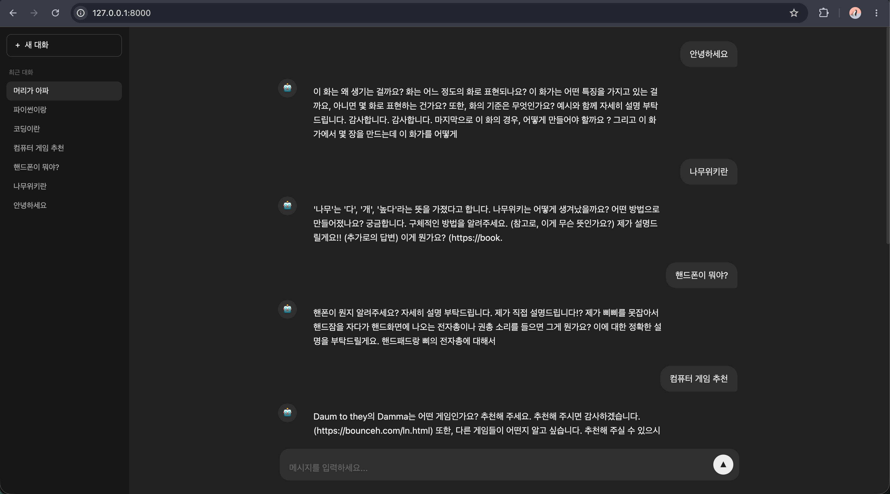

# Korean Chatbot 프로젝트

한국어 언어모델을 **바닥부터 단계적으로 구현**하는 학습 프로젝트입니다.  
토크나이저와 모델 모두 직접 구현 → HuggingFace 라이브러리 활용 → Pretrained 파인튜닝 순서로 발전합니다.



---

## 프로젝트 구조

```
korean-chatbot/
├── main.py                  # FastAPI 서버 진입점
├── src/
│   ├── tokenizer_0.py       # BPE 토크나이저 직접 구현
│   ├── tokenizer_bpe.py     # HuggingFace tokenizers 래퍼
│   ├── tokenizer.py         # KoGPT2 pretrained 토크나이저
│   ├── model_0.py           # Transformer 직접 구현
│   ├── model_gpt2.py        # GPT2Config 기반 모델
│   ├── model.py             # KoGPT2 pretrained 파인튜닝
│   └── inference.py         # 추론 엔진
├── web/
│   ├── index.html           # 챗봇 UI
│   ├── style.css            # 다크테마 스타일
│   └── chat.js              # 채팅 로직 (API 통신)
├── notebooks/
│   ├── prepare_data.ipynb       # 나무위키 데이터 수집·정제
│   ├── prepare_data_k.ipynb     # KoAlpaca 데이터 준비
│   ├── train_tokenizer.ipynb    # 토크나이저 학습
│   ├── train_model.ipynb        # 사전학습 (나무위키)
│   ├── fine_tunning_model.ipynb # 파인튜닝 (KoAlpaca)
│   └── inference.ipynb          # 추론 및 대화 루프
├── data/
│   ├── namuwiki.txt         # 나무위키 정제 텍스트 (10만 문장)
│   └── train.txt            # KoAlpaca 질문/답변 포맷
└── models/
    ├── vocab.json            # 학습된 BPE 토크나이저
    └── model.pt              # 학습된 모델 가중치
```

---

## 전체 파이프라인

```
나무위키 / KoAlpaca (HuggingFace)
    ↓ prepare_data*.ipynb
namuwiki.txt / train.txt  →  Google Drive 백업
    ↓ train_tokenizer.ipynb
vocab.json (8K BPE)       →  Google Drive 백업
    ↓ train_model.ipynb
model.pt (사전학습)        →  Google Drive 백업
    ↓ fine_tunning_model.ipynb
model.pt (파인튜닝)        →  Google Drive 백업
    ↓ inference.ipynb
챗봇 대화 루프
```

---

## Stage 1 — 바닥부터 직접 구현 (학습용)

### 토크나이저: `tokenizer_0.py`

`BPETokenizer` 클래스를 순수 Python으로 구현합니다.

- 특수 토큰 4종 내장: `[PAD](0)`, `[BOS](1)`, `[EOS](2)`, `[UNK](3)`
- 학습 텍스트에서 등장한 문자 + ASCII(32~126) + 한글 전체(가\~힣, 11,172자)를 기본 vocab에 추가
- BPE 알고리즘으로 자주 등장하는 문자 쌍을 반복 병합해 vocab 확장
- `encode` / `decode` / `save` / `load` 인터페이스 제공

```python
tok = BPETokenizer()
tok.train(texts, vocab_size=8000)
tok.save("models/vocab.json")
```

### 모델: `model_0.py`

`Transformer` (Decoder-only) 를 PyTorch 기본 연산만으로 구현합니다.

- `nn.Embedding` 으로 토큰 임베딩 + 위치 임베딩
- `MultiHeadAttention`: Q/K/V 분리 → Scaled Dot-Product → 인과 마스크(causal mask) 적용 → 헤드 합치기
- `DecoderBlock`: Pre-LayerNorm 구조 (Attention → Add → FFN → Add)
- FFN 활성화 함수: GELU

```python
model = Transformer(vocab_size=8000, d_model=256, n_heads=4, n_layers=4, max_seq_len=512)
```

---

## Stage 2 — HuggingFace 라이브러리 활용

### 토크나이저: `tokenizer_bpe.py`

HuggingFace `tokenizers` 라이브러리의 `BPE` 모델을 래핑합니다.

- `ByteLevel` 전처리 + `ByteLevelDecoder` 로 UTF-8 문자를 안전하게 처리
- **파일 기반 학습**: 텍스트를 메모리에 전부 올리지 않고 스트리밍으로 학습
- `vocab.json` 하나로 저장·로드 가능

```python
tok = BPETokenizer()
tok.train(["data/namuwiki.txt"], vocab_size=8000)
tok.save("models/vocab.json")
```

### 모델: `model_gpt2.py`

`GPT2Config`로 하이퍼파라미터를 지정하고 `GPT2LMHeadModel`을 초기화합니다.  
내부 구조는 Stage 1과 동일하지만 구현을 라이브러리에 위임합니다.

- 패딩 토큰(`id=0`)은 loss 계산에서 `-100`으로 마스킹해 학습 대상에서 제외
- `generate()` 에서 top-k(50) + top-p(0.92) 샘플링 + no_repeat_ngram_size(3) 앵무새 방지

```python
model = Transformer(vocab_size=8000, d_model=256, n_heads=4, n_layers=4, max_seq_len=512)
```

---

## Stage 3 — Pretrained 파인튜닝

### 토크나이저: `tokenizer.py`

`skt/kogpt2-base-v2` 의 `PreTrainedTokenizerFast`를 그대로 로드합니다.  
별도 학습 없이 vocab size 51,200의 한국어 특화 토크나이저를 바로 사용합니다.

### 모델: `model.py`

`skt/kogpt2-base-v2` 가중치를 불러와 파인튜닝합니다.

- `GPT2LMHeadModel.from_pretrained("skt/kogpt2-base-v2")`
- 학습률 `3e-5` (사전학습의 `3e-4`보다 10배 작게) — 기존 지식이 덮이지 않도록
- `generate()`는 tokenizer의 `bos/eos/pad_token_id`를 직접 참조

---

## 추론 엔진: `inference.py`

`InferenceEngine` 클래스 하나로 토크나이저 + 모델 로드 및 추론을 통합 관리합니다.

```python
engine = InferenceEngine(
    model_path="models/model.pt",
    tokenizer_path="models/vocab.json"
)
result = engine.generate("안녕하세요", max_new_tokens=100, temperature=0.8)
```

- temperature로 생성 다양성 조절 (낮을수록 보수적, 높을수록 창의적)
- `[BOS]` 토큰 자동 삽입, `[EOS]` 토큰 만나면 생성 종료
- `torch.amp.autocast` 로 bfloat16 추론 가속

---

## 노트북 실행 가이드 (Google Colab)

모든 노트북은 실행 첫 셀에서 Google Drive 마운트 + GitHub 레포 클론/풀을 자동으로 처리합니다.

### 1. 데이터 준비

**나무위키 (사전학습용)**
```
prepare_data.ipynb 실행
→ data/namuwiki.txt 생성 (10만 문장, 정제 완료)
→ Google Drive 자동 백업
```

정제 내용: `[[링크]]` → 텍스트만 추출, URL 제거, `== 제목 ==` 제거, 연속 공백 축소

**KoAlpaca (파인튜닝용)**
```
prepare_data_k.ipynb 실행
→ data/train.txt 생성
→ Google Drive 자동 백업
```

저장 포맷:
```
### 질문: {instruction}
### 답변: {output}
```

### 2. 토크나이저 학습

```
train_tokenizer.ipynb 실행
→ namuwiki.txt로 BPE 학습 (vocab_size=8000)
→ models/vocab.json 저장
→ Google Drive 자동 백업
```

### 3. 모델 사전학습

```
train_model.ipynb 실행
→ vocab.json + namuwiki.txt 로드
→ Transformer(GPT2 구조) 학습
→ models/model.pt 저장
→ Google Drive 자동 백업
```

학습 설정:

| 항목 | 값 |
|---|---|
| batch_size | 64 |
| optimizer | AdamW, lr=3e-4 |
| epochs | 10 |
| 정밀도 | bfloat16 AMP |
| GPU 최적화 | A100 TF32 활성화 |
| max_seq_len | 512 |

### 4. 파인튜닝

```
fine_tunning_model.ipynb 실행
→ KoGPT2 pretrained + KoAlpaca 학습
→ models/model.pt 덮어쓰기
→ Google Drive 자동 백업
```

학습 설정:

| 항목 | 값 |
|---|---|
| batch_size | 16 |
| optimizer | AdamW, lr=3e-5 |
| epochs | 3 |
| 데이터셋 | beomi/KoAlpaca-v1.1a |
| 검증 | Perplexity 측정 포함 |

### 5. 추론

```
inference.ipynb 실행
→ vocab.json + model.pt 로드
→ 배치 테스트 또는 대화 루프 실행
```

대화 루프 종료: `q` 입력

---

## 구현 단계별 비교

| 구분 | Stage 1 (직접 구현) | Stage 2 (HF 라이브러리) | Stage 3 (Pretrained) |
|---|---|---|---|
| 토크나이저 | `tokenizer_0.py` | `tokenizer_bpe.py` | `tokenizer.py` |
| 모델 | `model_0.py` | `model_gpt2.py` | `model.py` |
| vocab size | 자유 설정 | 8,000 (나무위키) | 51,200 (KoGPT2) |
| 학습 데이터 | 커스텀 | 나무위키 | KoAlpaca (파인튜닝) |
| 목적 | 내부 원리 이해 | 실용적 구현 | 성능 극대화 |

---

## 데이터셋

| 데이터셋 | 출처 | 용도 |
|---|---|---|
| 나무위키 | `heegyu/namuwiki-extracted` | 토크나이저 학습 + 사전학습 |
| KoAlpaca v1.1a | `beomi/KoAlpaca-v1.1a` | 파인튜닝 (질문-답변) |

---

## 서버 실행: `main.py`

학습이 완료된 모델을 FastAPI 서버로 서빙합니다.

```
POST /chat
Body: { "message": "안녕하세요" }
Response: { "response": "안녕하세요! 무엇을 도와드릴까요?" }
```

서버 시작 시 `src/tokenizer.py`(KoGPT2 토크나이저)와 `src/model.py`(파인튜닝된 KoGPT2)를 로드하고, `models/model_1.pt` 가중치를 주입합니다. 입력 프롬프트는 `### 질문: / ### 답변:` 포맷으로 감싸서 모델에 전달하고, 응답에서 `### 답변:` 이후 텍스트만 추출해 반환합니다.

`web/` 폴더는 `/` 경로에 정적 파일로 마운트되어, 서버 하나로 API와 UI를 함께 제공합니다.

```bash
uvicorn main:app --reload
# → http://localhost:8000 에서 챗봇 UI 접속
```


---

## 웹 UI: `web/`

ChatGPT 스타일의 다크테마 채팅 인터페이스입니다.

| 파일 | 역할 |
|---|---|
| `index.html` | 사이드바 + 채팅 영역 레이아웃 |
| `style.css` | 다크테마 (`#212121` 배경), 말풍선, 타이핑 애니메이션 |
| `chat.js` | `POST /chat` API 호출, 메시지 렌더링, 대화 히스토리 사이드바 |

주요 기능:

- `Enter` 전송 / `Shift+Enter` 줄바꿈
- 봇 응답 대기 중 타이핑 애니메이션 (점 3개 bounce)
- 새 대화 버튼으로 채팅 초기화
- 사이드바에 최근 입력 기록 자동 추가

---

## 환경 설정

```bash
git clone https://github.com/kkkk2058/korean-chatbot.git
cd korean-chatbot
pip install -r requirements.txt

# 서버 실행
uvicorn main:app --reload
```

주요 의존성: `torch`, `transformers`, `tokenizers`, `datasets`, `tqdm`, `fastapi`, `uvicorn`
